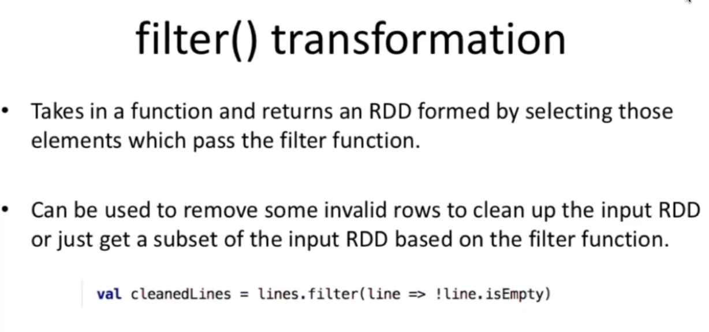

# 4 Spark Core y SQL

## Tipo de datos con los que trabajamos, RDD

Son distribuidas porque los datos estan distribuidos por los clusters

Son inmutables porque cada vez que hacemos una operación sobre el RDD creamos un nuevo RDD. Nunca manipulamos el origen de los datos.

Resiliente porque estan alojados los mismos datos en varios nodos por lo cual si se cae uno estan los demás con los mismos datos.

## Operaciones a un RDD
### Transformaciones

Filter

Map

Operaciones de conjuntos

### Acciones

collect: Recogeme todos los datos que tengo en el RDD

count: Cuentamelos todos.

countByValue: Cuentame cuantas valores tengo.

take: Da un conjuto limitado de datos, take(10)

saveAsTextFile: guardar el RDD filtrado o mapeado guardarlo como un archivo de texto

reduce: 
